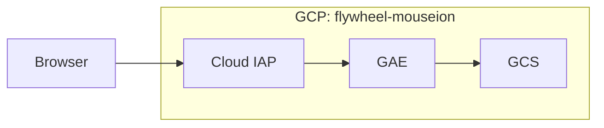

# Architecture

Mouseion consists of three components running in the `flywheel-mouseion` GCP project:

* [Cloud Identity-Aware Proxy (Cloud IAP)](https://console.cloud.google.com/security/iap?project=flywheel-mouseion) controls access to our GAE application. Only users belonging to `flywheel.jp` domain are allowed to access the application.
* [Google App Engine (GAE)](https://console.cloud.google.com/appengine?project=flywheel-mouseion) proxies GCS. [flywheel-jp/mouseion](https://github.com/flywheel-jp/mouseion) repository mainly contains its source code.
* [Google Cloud Storage (GCS)](https://console.cloud.google.com/storage/browser/flywheel-mouseion/?project=flywheel-mouseion) stores documents.
